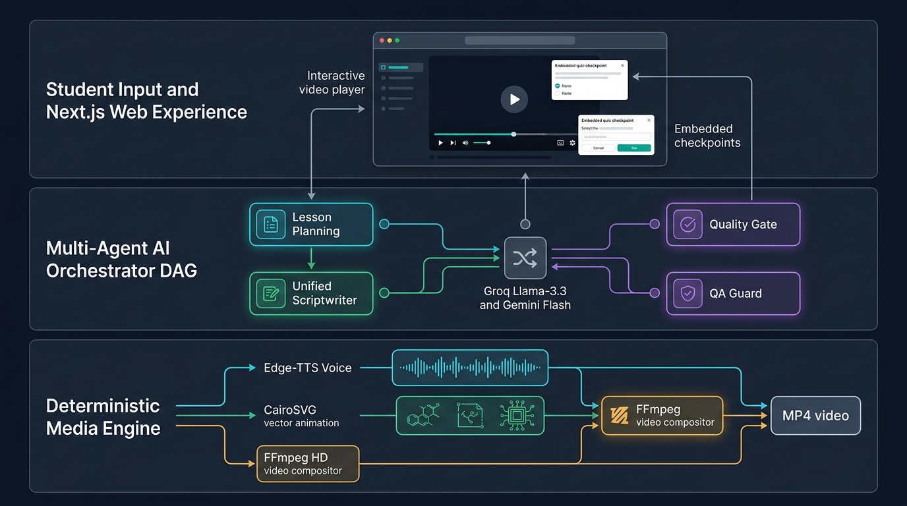
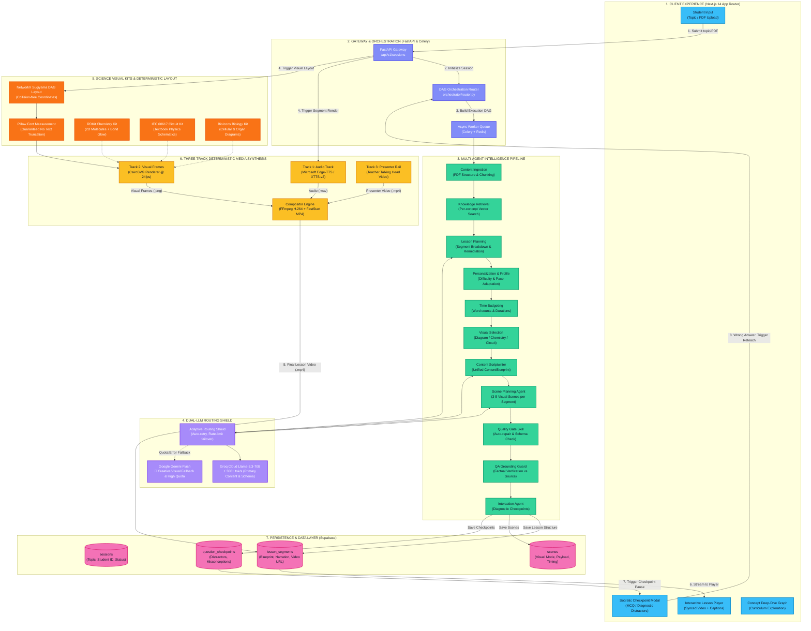
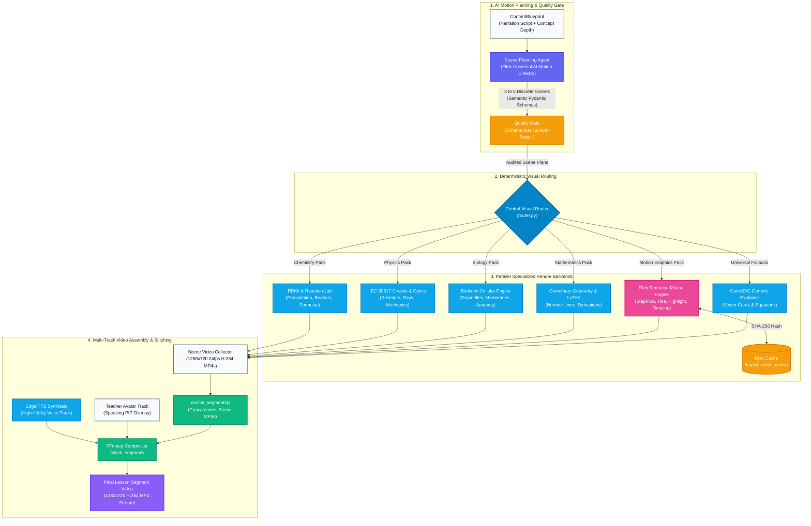
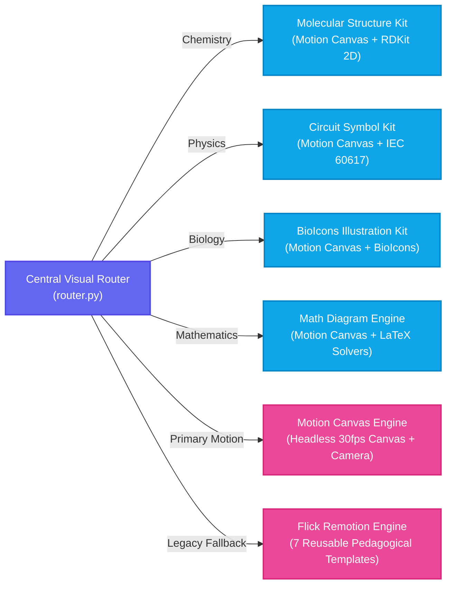
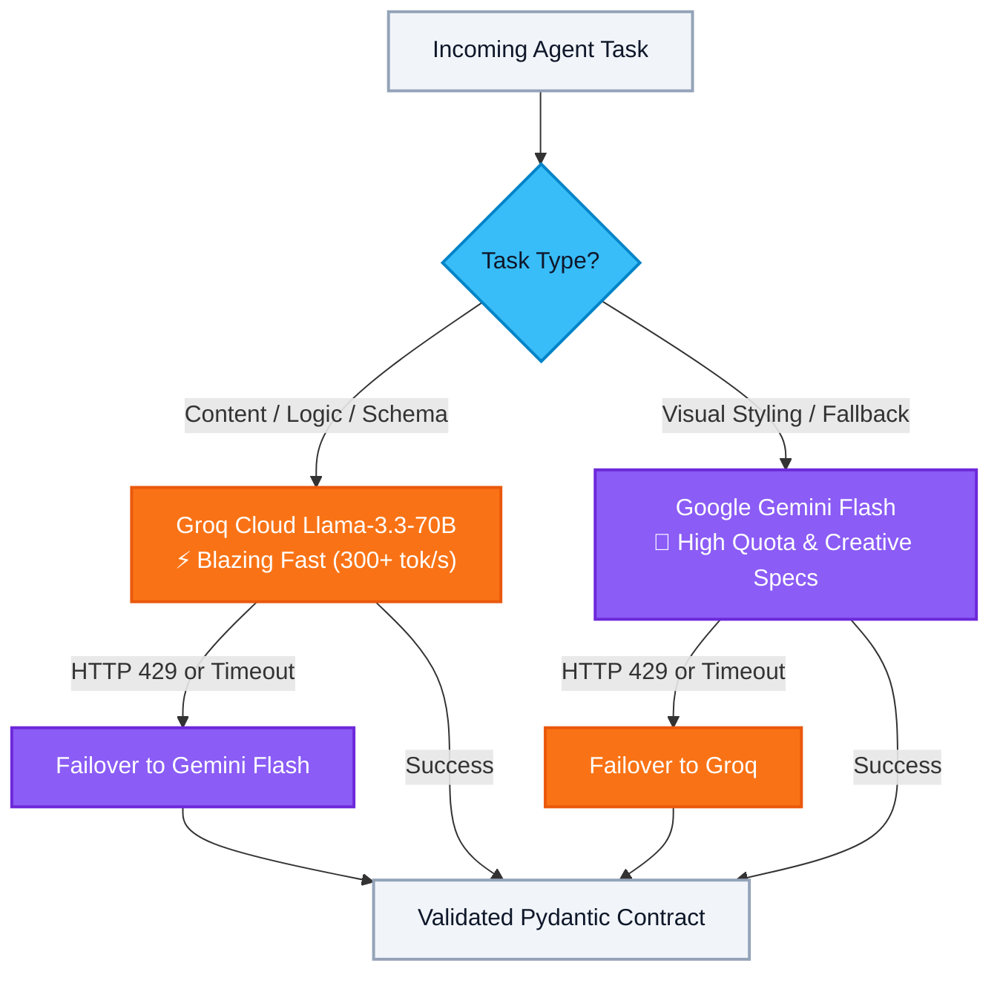
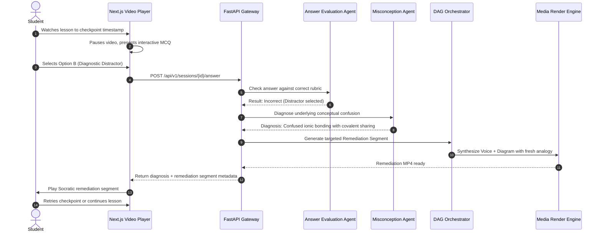
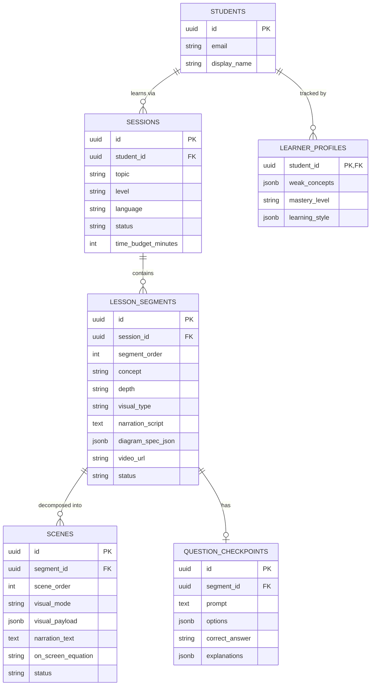

# Shikshak AI — Visual Architecture & System Guide

> **A comprehensive, visual, and architectural guide to how Shikshak AI transforms topics and textbook documents into interactive, animated, and Socratic video lessons.**



---

## 1. Executive Mental Model (The 30-Second Overview)

Traditional "AI video" platforms use generative video diffusion models (e.g., Sora, Runway, Kling). While visually impressive, generative models suffer from **five fundamental pedagogical failures**:
1. **Scientific Hallucination:** Chemical bonds, circuit symbols, and mathematical steps are distorted or physically impossible.
2. **Text Illegibility:** On-screen text warps, blends, or becomes unreadable gibberish.
3. **Audio-Visual Drift:** The voice narration describes concept $A$ while the video depicts concept $B$.
4. **Massive Latency & Cost:** Rendering a 3-minute video takes 3–10 minutes of GPU cluster compute.
5. **Zero Interactivity:** The output is a static video file with no way to pause for quizzes or remediate misconceptions.

**Shikshak AI solves this with a Scene-First, Deterministic Multi-Agent Architecture:**

```
┌─────────────────────────────────────────────────────────────────────────────────────────────┐
│                                   THE SHIKSHAK TRIAD                                        │
├───────────────────────────────┬───────────────────────────────┬─────────────────────────────┤
│   1. MULTI-AGENT REASONING    │  2. DETERMINISTIC RENDERING   │   3. SOCRATIC INTERACTION   │
│                               │                               │                             │
│ • Breaks curricula into       │ • Zero LLM calls at render    │ • Interactive video player  │
│   pedagogical segments        │ • Algorithmic DAG layout      │ • Mid-lesson checkpoints    │
│ • Generates simultaneous      │ • Textbook-grade science kits │ • Misconception detection   │
│   Narration + Diagram specs   │   (RDKit, IEC circuits, Bio)  │ • On-the-fly remediation    │
│ • Enforces strict schema gates│ • 1280x720 HD @ 24fps in <2s  │   segment splicing          │
└───────────────────────────────┴───────────────────────────────┴─────────────────────────────┘
```

---

## 2. Complete End-to-End System Architecture

The following diagram details how data flows across all 7 layers of Shikshak AI — from student input to video playback:



---

## 3. The End-to-End Life of a Lesson (Step-by-Step)

Here is exactly what happens when a student requests a lesson on **"Photosynthesis and Cellular Respiration"**:

```
[ PHASE 1: INGESTION & CURRICULUM PLANNING ]
  1. Student enters "Photosynthesis" or uploads an NCERT Biology chapter PDF.
  2. Content Ingestion Agent parses the document structure (sections, headings, formulas).
  3. Lesson Planning Agent reads the student's learning profile (prior weak concepts, level).
  4. Output: A 3-segment lesson plan:
       • Segment 1: Light Reactions (Visual: Chloroplast Flowchart)
       • Segment 2: The Calvin Cycle (Visual: Cycle Diagram + Checkpoint Quiz)
       • Segment 3: ATP Synthesis (Visual: Molecular/Energy Diagram)

[ PHASE 2: UNIFIED CONTENT SCRIPTWRITING (Groq Llama-3.3-70B) ]
  5. For each segment, the Content Scriptwriter generates a SINGLE `ContentBlueprint`:
     ┌─────────────────────────────────────────────────────────────────────────────┐
     │ Narration: "Inside the thylakoid membrane, sunlight energizes chlorophyll   │
     │            electrons, splitting water into oxygen and hydrogen ions..."     │
     ├─────────────────────────────────────────────────────────────────────────────┤
     │ Diagram Spec:                                                               │
     │   • Nodes: [Sunlight, Chlorophyll, Water, Oxygen, H+ Ions, ATP]             │
     │   • Edges: Sunlight -> Chlorophyll -> Water -> [Oxygen + H+ Ions] -> ATP    │
     │   • Layout: "flowchart" | Color Tokens: locked textbook palette             │
     └─────────────────────────────────────────────────────────────────────────────┘

[ PHASE 3: SCENE PLANNING & QUALITY GATE AUDIT ]
  6. Scene Planning Agent decomposes the segment into 3-4 granular visual scenes:
       • Scene 1: Sunlight photons striking the chlorophyll complex.
       • Scene 2: Water molecule splitting ($2H_2O \rightarrow 4H^+ + O_2 + 4e^-$).
       • Scene 3: Proton gradient driving ATP synthase.
  7. Quality Gate Skill audits the scene payload:
       • Validates JSON schemas and visual modes.
       • Checks on-screen text length (<= 28 chars per label) to avoid clipping.
       • Ensures mathematical/chemical equations are formatted correctly.

[ PHASE 4: DETERMINISTIC 3-TRACK MEDIA SYNTHESIS (Zero Render-Time LLM Calls) ]
  8. Audio Track: Microsoft Edge-TTS synthesizes natural teacher voice in parallel.
  9. Visual Track:
       • NetworkX computes Sugiyama-layered DAG coordinates for all nodes.
       • Pillow measures pixel length of every label for precise container padding.
       • CairoSVG renders 24 frames/sec with smooth opacity fades and active node pulses.
 10. Presenter Track: Teacher avatar rail is generated or pulled from cached profile assets.
 11. Assembly: FFmpeg composites all three tracks into a 1280x720 HD MP4 with `+faststart`.

[ PHASE 5: PLAYBACK & THE SOCRATIC INTERACTION LOOP ]
 12. Student watches Segment 1; video smoothly transitions into Segment 2.
 13. At 01:45, the video pauses: Checkpoint question appears on screen.
 14. If Student answers correctly: Celebratory feedback plays, and Segment 3 resumes.
 15. If Student picks a diagnostic distractor:
       • Misconception Detection Agent identifies the exact confusion.
       • Orchestrator generates a targeted 30-second remediation segment with a fresh analogy.
       • The remediation segment is spliced directly into the video playlist dynamically!
```

---

## 4. Multi-Agent Directory & Responsibilities Matrix

The orchestrator coordinates 12 specialized agents and skills across the session lifecycle:

| Agent / Skill | Responsibility | Primary Input | Output | Primary Model / Engine |
| :--- | :--- | :--- | :--- | :--- |
| **Content Ingestion** | Extracts hierarchical sections, tables, and text from PDFs/DOCXs | Raw PDF / PPTX file | Document chunk hierarchy | PyPDF / pdfplumber |
| **Knowledge Retrieval** | Semantic retrieval of top-$k$ relevant source chunks per concept | Concept name + Document ID | Grounding text chunks | pgvector / embeddings |
| **Lesson Planning** | Builds pedagogical segment curriculum tailored to student level | Topic + Weak concepts | Ordered segment list | Groq Llama-3.3-70B |
| **Personalization** | Adjusts terminology depth, pacing, and real-world analogies | Learner profile + Plan | Personalized segment spec | Groq Llama-3.3-70B |
| **Time Budgeting** | Allocates exact duration and target word counts to each segment | Session budget (e.g. 5 min) | Per-segment word & second budgets | Deterministic Math |
| **Visual Selection** | Chooses optimal visual presentation mode for each concept | Segment concept & domain | Visual mode tag (circuit, bio, etc.) | Rule-based / Groq |
| **Content Scriptwriter** | Simultaneously outputs spoken narration and diagram graph spec | Grounding chunks + Concept | `ContentBlueprint` (Audio + Visual) | Groq Llama-3.3-70B |
| **Scene Planning** | Decomposes segments into 3–5 timed visual scenes | Narration script + Visual mode | Ordered `ScenePlanRaw` list | Groq Llama-3.3-70B |
| **Quality Gate** | Validates scene payloads, sanitizes text lengths, auto-repairs | Scene plans | Validated & repaired scenes | Pure Python Rule Engine |
| **QA Grounding Guard** | Verifies narration facts against source chunks to prevent hallucination | Narration + Source text | Audited & verified narration | Groq / Gemini Flash |
| **Interaction Agent** | Generates conceptual checkpoint questions with diagnostic distractors | Segment concept + Depth | Checkpoint MCQ + Explanations | Groq Llama-3.3-70B |
| **Misconception Detection** | Diagnoses student errors and drafts remediation scripts | Student wrong answer + Target | Remediation script + Analogy | Groq Llama-3.3-70B |

---

## 5. Scene-First Video Generation & Rendering Architecture

Shikshak AI implements a **Scene-First Deterministic Video Pipeline**. Rather than generating a single monolithic diagram or relying on generative AI video APIs (which hallucinate formulas, drift out of sync, and take minutes to render), the system decomposes each lesson segment into **discrete, timed pedagogical scenes** rendered by specialized deterministic vector engines and motion templates, then stitched into a final stream via FFmpeg.

### High-Level Video Generation Architecture

```
                                 SHIKSHAK
                                    │
                              Lesson Planner
                                    │
                             ContentBlueprint
                                    │
                              Semantic Scene
                                    │
                               Quality Gate
                                    │
                              Motion Director
                           (Flick Scene Planner)
                                    │
                          Visual Renderer Router
                                    │
        ┌──────────────┬────────────┼────────────┬──────────────┬──────────────┐
        │              │            │            │              │              │
        ▼              ▼            ▼            ▼              ▼              ▼
    Chemistry       Physics      Biology        Math          Motion        Generic
    Renderer       Renderer     Renderer      Renderer       Renderer       Fallback
        │              │            │            │              │              │
      RDKit        IEC 60617    BioIcons    LaTeX/Algebra     Flick         CairoSVG
   Reaction Lab     Circuits    Cellular     Number Line     Remotion      Explainer
        │              │            │            │              │              │
        └──────────────┴────────────┼────────────┴──────────────┴──────────────┘
                                    │
                                    ▼
                              Scene Timeline
                         (Per-Scene 1280x720 MP4s)
                                    │
                                    ▼
                               Composition
                        (Scene Video + Audio + PIP)
                                    │
                                    ▼
                                  FFmpeg
                                    │
                                    ▼
                              Final Video
```

### Detailed Video Generation Pipeline Flowchart



---

### Architectural Tenet: The Coordinate Invariant
> [!IMPORTANT]
> **No LLM in Shikshak AI is ever allowed to output `x`, `y`, `width`, or `height` coordinates, CSS styles, or arbitrary React/Canvas code.**
> The LLM provides high-level semantic intent via `AnimationSceneSpec` (`SemanticObject`, `SemanticBeat`, `SemanticCameraKeyframe`). The rendering engines algorithmically calculate layout geometry based on true domain topology, font metrics, and kinetic camera choreography.

```
OLD WAY (Flawed):
LLM ──(hallucinates)──► [Node A: x=120, y=340] + [Node B: x=140, y=350] ──► Overlapping Boxes & Cutoff Text!

SHIKSHAK WAY (Deterministic):
LLM ──(semantic intent only)──► AnimationSceneSpec { objects: [...], beats: [...], camera: [...] }
                                            │
                                            ▼
                                [ Central Visual Router ]
                                Resolves visual_mode to Motion Canvas / Scientific Adapters
                                            │
                                            ▼
                           [ Headless Motion Canvas Engine ]
                           Deterministic 1280x720 HD @ 30fps streaming directly to FFmpeg
```

---

### The Science & Motion Visual Kits

For domain-specific concepts, the visual pipeline routes to dedicated vector rendering engines, Motion Canvas adapters, and legacy Remotion fallback templates:



1. **Molecular Structure Kit (Chemistry):** Uses **Motion Canvas** and **RDKit** for equation balancing ($Fe + H_2O \to Fe_3O_4 + H_2$), atom inventory verification (strictly NO seesaw / balance scale metaphors), and reaction kinetics.
2. **Circuit Symbol Kit (Physics):** Uses **Motion Canvas** with **IEC 60617** vector symbols, animated switch closure, directional electron drift, and resistor voltage drop.
3. **BioIcons Kit (Biology):** Realizes cellular processes (photosynthesis thylakoid light reactions, photolysis, proton gradients, and ATP synthase rotor dynamics).
4. **Math Diagram Engine (Mathematics):** Realizes step-by-step algebraic equation transformations and quadratic formula derivations with term continuity.
5. **Motion Canvas Core Engine (Primary Educational Motion):** Headless 30fps canvas rendering pipeline with semantic camera choreography (`establish`, `focus`, `pullback`) streaming frame buffers to FFmpeg with SHA-256 caching.
6. **MuseTalk v1.5 Apple Silicon Presenter:** Fast local talking-head generation running on Metal Performance Shaders (MPS) with female educator profile (`female_teacher_v1`). Composited dynamically (`TEACHER_EXPLAIN` PIP, `TEACHER_INTRO`, `TEACHER_OFF_SCREEN`) replacing the fixed 300px sidebar.

---

## 6. The Dual-LLM Routing Shield

To prevent API rate limits (HTTP 429) from interrupting lessons, Shikshak AI operates a resilient routing shield:



### Why This Dual Strategy Works:
- **Groq Llama-3.3-70B** provides near-instantaneous JSON schema responses (sub-second generation of complete blueprints).
- **Gemini Flash** acts as an expansive visual-reasoning fallback with generous rate limits.
- If either provider experiences downtime or regional rate caps, the orchestrator automatically swaps models transparently with zero disruption to the student.

---

## 7. The Socratic Feedback & Remediation Loop

When a student reaches an embedded question checkpoint, the player enters an interactive diagnostic mode:



---

## 8. Database Entity Relationship Model (Supabase)

The database schema is organized around the session hierarchy and pedagogical checkpoints:



---

## 9. Technology Stack & Directory Map

```
shikshak-ai/
├── apps/
│   ├── api/                          # FastAPI Backend & Orchestrator
│   │   ├── agents/                   # The 12 Autonomous Agents
│   │   │   ├── content_ingestion.py  # Document & PDF parsing
│   │   │   ├── lesson_planning.py    # Curriculum segmentation
│   │   │   ├── content_scriptwriter.py# Unified ContentBlueprint generator
│   │   │   ├── scene_planning.py     # Flick Universal AI Motion Director (multi-subject scene breakdown)
│   │   │   ├── visual_selection.py   # Subject & visual mode routing
│   │   │   ├── qa_grounding_guard.py # Grounding verification against source
│   │   │   └── interaction.py        # Checkpoint MCQ generation
│   │   ├── orchestrator/             # Execution Planning & Router
│   │   │   ├── router.py             # DAG pipeline runner
│   │   │   └── execution_plan.py     # Celery chain/group step builder
│   │   ├── skills/                   # Deterministic Engines & Utilities
│   │   │   ├── scene_renderers/      # Centralized Visual Router & Domain Backends
│   │   │   │   ├── router.py         # Deterministic visual_mode dispatch
│   │   │   │   ├── flick_renderer.py # Remotion engine wrapper with SHA-256 caching & CairoSVG fallback
│   │   │   │   ├── chemistry.py      # RDKit reaction lab & equation build
│   │   │   │   ├── physics.py        # IEC 60617 circuits & optics ray diagrams
│   │   │   │   ├── biology.py        # BioIcons cellular & anatomical cross-sections
│   │   │   │   └── mathematics.py    # Real number lines & algebra step solver
│   │   │   ├── diagram_engine/       # Sugiyama layout & font metric calculations
│   │   │   ├── quality_gate.py       # Scene validation & auto-repair skill
│   │   │   ├── tts_synthesis.py      # Edge-TTS voice synthesis
│   │   │   └── video_stitching.py    # FFmpeg multi-track compositing (scenes + audio + PIP avatar)
│   │   └── main.py                   # FastAPI REST API endpoints
│   │
│   └── web/                          # Next.js 15 Web Application
│       ├── app/
│       │   ├── (app)/session/[id]/   # Interactive player & checkpoint UI
│       │   ├── (app)/dashboard/      # Student learning path & weak spots
│       │   └── (marketing)/          # Landing page & demo entrance
│       └── components/               # UI components (Video, Checkpoints, Nav)
│
├── packages/
│   └── motion-engine/                # Flick / Remotion Deterministic Motion Graphics Package
│       ├── src/
│       │   ├── templates/            # 7 Reusable pedagogical motion templates
│       │   │   ├── StepByStepFlow.tsx
│       │   │   ├── AnimatedTitle.tsx
│       │   │   ├── ConceptHighlight.tsx
│       │   │   ├── Comparison.tsx
│       │   │   ├── Timeline.tsx
│       │   │   ├── TextReveal.tsx
│       │   │   └── DiagramBuild.tsx
│       │   ├── compositions/         # MotionScene composition router
│       │   ├── render.ts             # Programmatic headless Chrome CLI renderer
│       │   └── Root.tsx              # Remotion root registry
│       └── package.json              # Remotion 4.0, React 18, lucide-react
│
├── assets/                           # Vector icons, circuit symbols & teacher avatar
└── docs/assets/                      # Architectural diagrams and media
```

---

## 10. Summary of Architectural Guarantees

| Metric / Aspect | Generative AI Video (Runway / Sora) | Shikshak AI Deterministic Engine |
| :--- | :--- | :--- |
| **Generation Latency** | 3 to 10 minutes per segment | **< 2.5 seconds** per segment |
| **Scientific Accuracy** | Frequent hallucinations in formulas & bonds | **100% textbook-accurate** (RDKit / IEC) |
| **Text Legibility** | Distorted, unreadable AI artifacts | **Crisp vector typography** (CairoSVG + Inter) |
| **Audio-Visual Sync** | Random drift between voice and imagery | **100% synchronized** via unified blueprint |
| **Render-Time Failures** | High failure rate from external video APIs | **0 render-time LLM calls** (pre-computed specs) |
| **Student Interactivity** | Flat MP4 file with zero pause intelligence | **Real-time Socratic checkpoints & remediation** |
| **Compute Cost** | \$0.50 – \$3.00 per minute of video | **<\$0.01 per segment** (Groq + local CPU render) |
