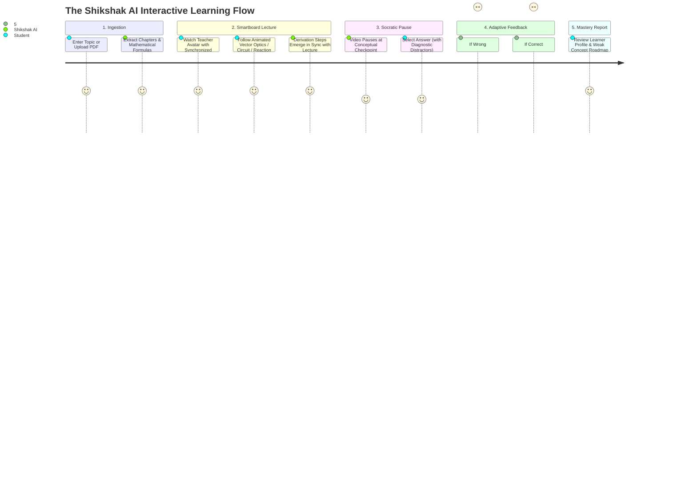

# 🎓 Shikshak AI — The AI Teacher That Actually Teaches

<div align="center">

> **Transform any topic or textbook into an interactive video lecture with an authentic classroom smartboard vibe, live Socratic checkpoints, diagnostic misconception remediation, and scientifically accurate vector animations.**

[](https://shikshak-web.onrender.com/)
[](https://nextjs.org/)
[](https://fastapi.tiangolo.com/)
[](https://python.org/)
[](https://supabase.com/)
[](LICENSE)

[**Explore Live Demo**](https://shikshak-web.onrender.com/) • [**System Architecture**](ARCHITECTURE.md) • [**Quick Start**](#-quick-start) • [**Visual Engine**](#-vector-visual-engine--classroom-smartboard) • [**Free Cloud Deployment**](#-free-cloud-deployment-render--supabase)

</div>

---

## 🌟 Why Shikshak AI?

Most generative educational video tools fail at **actual teaching**. They download irrelevant stock photos (e.g. random desk lamps when explaining optics), hallucinate chemical formulas, suffer from audio-visual drift, and generate passive videos that students passively watch and forget.

**Shikshak AI** is engineered from the ground up to reproduce the **authentic classroom lecture experience**:

| ❌ Generic Video AI Tools | ✅ Shikshak AI Socratic Engine |
|:---|:---|
| **Stock Photos & Random Imagery** (desk lamps, clip art, photo zooms) | **100% Vector Classroom Chalkboard** (slate grid, glowing formula boxes, animated derivations) |
| **Hallucinated Equations & Jargon** | **Scientifically Verified Formulas** (LaTeX/monospace canonical laws, RDKit molecules, IEC 60617 circuits) |
| **Passive Watching (Low Retention)** | **Interactive Socratic Checkpoints** that pause playback to test understanding |
| **Ignored Mistakes** | **Misconception Detection & Remediation** diagnosing *why* a choice was wrong with targeted analogies |
| **Static Lip-Sync / Frozen Faces** | **Lip-Synchronized Avatar** with audio-envelope phone animation & head bobbing |
| **Slow Multi-Minute Renders** | **20–60s End-to-End Render** via streaming CairoSVG frame pipes to FFmpeg |
| **One-Size-Fits-All Script** | **Adaptive Depth & Pacing** personalized to student level, language, and weak concepts |

---

## 🎬 The Student Learning Journey



---

## 🎨 Vector Visual Engine & Classroom Smartboard

Shikshak AI guarantees **zero stock photos and zero irrelevant images**. All scenes render deterministic, pure vector visual components piped directly to FFmpeg:

### 1. 🏫 Classroom Smartboard & Chalkboard Aesthetic
* **Canvas Style**: Deep chalkboard slate (`#0b1320`), academic coordinate grid, chalk border frame.
* **Top Lecture Banner**: `CLASSROOM LECTURE · PROFESSOR'S SMARTBOARD · CORE PRINCIPLES`.
* **Dedicated Formula & Law Card**: Highlighted glowing monospace cards rendering canonical scientific laws:
  * **Optics**: $\angle i = \angle r$ *(Law of Reflection)* • $\frac{1}{f} = \frac{1}{v} - \frac{1}{u}$ *(Lens Equation)*
  * **Photosynthesis**: $6\text{CO}_2 + 6\text{H}_2\text{O} + \text{Sunlight} \longrightarrow \text{C}_6\text{H}_{12}\text{O}_6 + 6\text{O}_2$
  * **Respiration**: $\text{C}_6\text{H}_{12}\text{O}_6 + 6\text{O}_2 \longrightarrow 6\text{CO}_2 + 6\text{H}_2\text{O} + 38\text{ ATP}$
  * **Electricity**: $V = I \cdot R$ *(Ohm's Law)* • $P = V \cdot I = I^2R$
  * **Mechanics**: $F_{\text{net}} = m \cdot a$ • $p = m \cdot v$
* **Progressive Derivations**: Numbered step cards (`01`, `02`, `03`) animated in sync with spoken narration.
* **Interactive Vector Schema**: Animated physical apparatus (e.g. incident light rays reflecting off a plane mirror with animated normal and marked angles $\angle i$ and $\angle r$).

### 2. ⚡ Physics & Circuit Pack
* **`optics_ray_diagram`**: Geometric ray tracing with convex/concave lenses, optical center $O$, principal focus $F_1, F_2$, object arrow, and real inverted image.
* **`spherical_mirror`**: Ray geometry proving $f = \frac{R}{2}$ and mirror formula $\frac{1}{v} + \frac{1}{u} = \frac{1}{f}$.
* **`circuit_simulation`**: IEC 60617 symbols, resistors, batteries, meters, with animated flowing electron current.

### 3. 🧪 Chemistry & Reaction Lab
* **`reaction_lab`**: Beakers with color changes, precipitate settling, and RDKit 2D chemical structure callouts.
* **`equation_build`**: Step-by-step cross-valency chemical formula assembly (e.g. $\text{Al}^{3+} + \text{SO}_4^{2-} \to \text{Al}_2(\text{SO}_4)_3$).
* **`balancing_exercise`**: Conservation of mass and atom inventory verification.

### 4. 🧬 Biology & Metabolic Pathways
* **`bio_cellular_process`**: Chloroplast double membrane, thylakoid grana stacks, photolysis, and animated ATP/$O_2$ product bursts.
* **`anatomical_structure`**: Anatomical cross-sections with labeled callouts and physiological functions.

### 5. 📐 Mathematics & Derivation Solver
* **`algebra_step_solve`**: Step-by-step kinetic algebraic derivations (e.g., quadratic formula completion of squares).
* **`number_line_geometry`**: Exact real number geometric constructions (e.g. $\sqrt{2}$ right-triangle hypotenuse).

---

## 🤖 The 12-Agent Intelligence Pipeline

```
┌─────────────────────────────────────────────────────────────────────────────────┐
│                           DAG ORCHESTRATION PIPELINE                            │
└─────────────────────────────────────────────────────────────────────────────────┘
         │
         ▼
 1. [Content Ingestion] ──── Extract clean sections, tables, formulas from PDF/topic
         │
         ▼
 2. [Curriculum Planner] ─── Build 3–5 core pedagogical segments (no introductory fluff)
         │
         ▼
 3. [Personalization] ────── Adjust depth, student level & filter placeholder concepts
         │
         ▼
 4. [Scriptwriter Agent] ─── Generate synchronized narration script with pedagogical beats
         │
         ▼
 5. [Scene Planner] ──────── Decompose segment into 3–5 granular classroom scenes
         │
         ▼
 6. [Visual Director] ────── Route domain keywords to specialized vector animation packs
         │
         ▼
 7. [Quality Gate] ───────── Enforce Pydantic schema validation & zero-stock-photo rules
         │
         ▼
 8. [Vector Renderers] ───── CairoSVG 24fps frame generator piped to FFmpeg (H.264)
         │
         ▼
 9. [Speech & Avatar] ────── Edge-TTS natural audio + Wav2Lip / Lively audio envelope lips
         │
         ▼
10. [Interaction Engine] ─── Checkpoint questions with targeted diagnostic distractors
         │
         ▼
11. [Misconception Guard] ── Real-time error diagnosis & 30-second remediation generation
         │
         ▼
12. [Assessment Engine] ──── Student mastery profile updating & continuous learning path
```

---

## 💻 Tech Stack

### Frontend (`apps/web`)
* **Framework**: Next.js 15 (App Router), React 18, TypeScript
* **Styling**: Tailwind CSS, Lucide Icons, Glassmorphic UI tokens
* **Video Player**: Custom interactive player with HTTP 206 Byte-Range seeking & pause-on-checkpoint
* **Auth & DB Client**: `@supabase/ssr` with Row Level Security (RLS)
* **State Management**: React Query, Zustand

### Backend (`apps/api`)
* **Framework**: FastAPI (async ASGI) with Uvicorn
* **Task Queue**: Celery with Redis broker (distributed async pipeline)
* **LLM Intelligence**: Groq Cloud (Llama-3.3-70B at 300+ tokens/sec) + Google Gemini 2.0 Flash fallback
* **Vector Graphics**: CairoSVG, Pillow, RDKit, SVG XML frame generators
* **Video Compositing**: FFmpeg (H.264 / AAC 3-track composite)
* **Voice & Lip-Sync**: Microsoft Edge-TTS (40+ natural voices), Kokoro, Wav2Lip, Lively Avatar

### Database & Cloud
* **Database**: Supabase PostgreSQL with `pgvector` for semantic search
* **Caching**: SHA-256 keyed video scene cache for instant reuse
* **Deployment**: Render Blueprint (`render.yaml`) for 1-click cloud hosting

---

## 📁 Repository Structure

```text
shikshak-ai/
├── apps/
│   ├── api/                                # 🐍 FastAPI + Celery Backend
│   │   ├── agents/                         # 12 AI Orchestrator Agents
│   │   │   ├── lesson_planning.py          # Curriculum planner (direct concept start)
│   │   │   ├── scene_planning.py           # Classroom smartboard scene planner
│   │   │   ├── visual_director.py          # Vector animation router
│   │   │   ├── personalization.py          # Student level & weak concept adapter
│   │   │   ├── misconception_detection.py  # Diagnostic Socratic remediation
│   │   │   └── interaction.py              # Checkpoint question builder
│   │   ├── skills/                         # Specialized Vector Engines & Skills
│   │   │   ├── scene_renderers/            # 25+ Vector Smartboard Renderers
│   │   │   │   ├── physics/                # Optics ray tracing, circuits, mirrors
│   │   │   │   ├── chemistry/              # Beakers, reactions, balancing
│   │   │   │   ├── biology/                # Chloroplast, cellular respiration, anatomy
│   │   │   │   ├── mathematics/            # Coordinate geometry, algebra solve
│   │   │   │   └── generative/             # Classroom Smartboard & Split-Screen
│   │   │   ├── avatar/                     # Wav2Lip & Lively Avatar lip-sync
│   │   │   └── image_generation/           # Deterministic chalkboard generator
│   │   ├── models/                         # Pydantic schemas & payload validators
│   │   ├── main.py                         # FastAPI REST endpoints
│   │   ├── celery_app.py                   # Celery distributed worker configuration
│   │   ├── config.py                       # Dynamic URL & settings manager
│   │   ├── start.sh                        # Production dual-daemon bootstrap script
│   │   └── requirements.txt                # Python dependencies
│   │
│   └── web/                                # ⚛️ Next.js 15 Web Application
│       ├── app/
│       │   ├── (app)/
│       │   │   ├── session/[id]/           # Interactive Socratic Video Player
│       │   │   ├── session/new/            # Lesson creator (topic or PDF upload)
│       │   │   ├── dashboard/              # Student mastery analytics
│       │   │   └── how-it-works/           # Interactive system architecture diagram
│       │   └── (marketing)/                # Landing page & demo showcase
│       ├── components/
│       │   ├── lesson/VideoPlayer.tsx      # Video player with checkpoint modals
│       │   └── system-flow/                # Visual architecture flowchart
│       └── lib/
│           ├── supabase/                   # Supabase SSR client
│           └── api.ts                      # Backend API client
│
├── supabase/
│   ├── migrations/                         # 17 PostgreSQL migrations with RLS
│   └── apply_missing_migrations.sql        # Consolidated database setup script
│
├── render.yaml                             # 🚀 1-Click Render Cloud Blueprint
├── ARCHITECTURE.md                         # 🏗️ In-depth system design & data contracts
└── README.md                               # 📄 You are here!
```

---

## 🚀 Quick Start

### Prerequisites
* **Node.js 20+** and **Python 3.11+**
* **FFmpeg** (`brew install ffmpeg` or `apt-get install ffmpeg`)
* **Cairo** (`brew install cairo` or `apt-get install libcairo2-dev`)
* **Redis** (local or free cloud Upstash)

### 1. Clone & Install Dependencies

```bash
# Clone the repository
git clone https://github.com/Kanishkp19/shikshak.git
cd shikshak

# Setup Backend Virtualenv
cd apps/api
python3 -m venv venv
source venv/bin/activate    # On Windows: venv\Scripts\activate
pip install -r requirements.txt

# Setup Frontend Dependencies
cd ../web
npm install
```

### 2. Configure Environment Variables

**Backend (`apps/api/.env`):**
```env
GROQ_API_KEY=gsk_...
GEMINI_API_KEY=AIzaSy...
SUPABASE_URL=https://your-project.supabase.co
SUPABASE_SERVICE_ROLE_KEY=eyJh...
REDIS_URL=redis://localhost:6379/0
PUBLIC_API_URL=http://localhost:8000
```

**Frontend (`apps/web/.env.local`):**
```env
NEXT_PUBLIC_SUPABASE_URL=https://your-project.supabase.co
NEXT_PUBLIC_SUPABASE_ANON_KEY=eyJh...
NEXT_PUBLIC_API_BASE_URL=http://localhost:8000
```

### 3. Run Locally

```bash
# Terminal 1: Backend API (Uvicorn)
cd apps/api
source venv/bin/activate
uvicorn main:app --reload --port 8000

# Terminal 2: Celery Background Worker
cd apps/api
source venv/bin/activate
celery -A celery_app worker --loglevel=info

# Terminal 3: Frontend (Next.js 15)
cd apps/web
npm run dev
```

Visit **`http://localhost:3000`** in your browser.

---

## ☁️ Free Cloud Deployment (Render + Supabase)

Shikshak AI is engineered to deploy to production on **100% Free Tiers**:

### 1. Database Setup (Supabase)
1. Create a free project at [Supabase](https://supabase.com/).
2. Open the **SQL Editor** in your Supabase Dashboard.
3. Paste and run [`supabase/apply_missing_migrations.sql`](supabase/apply_missing_migrations.sql) to provision all tables, columns, and RLS policies.

### 2. Redis Setup (Upstash)
1. Create a free serverless Redis database at [Upstash](https://upstash.com/).
2. Copy the `rediss://...` connection string.

### 3. 1-Click Deployment (Render)
1. Fork or push this repository to GitHub: `https://github.com/Kanishkp19/shikshak.git`.
2. Log into [Render](https://dashboard.render.com/) and click **New +** → **Blueprint**.
3. Select your repository. Render will automatically read [`render.yaml`](render.yaml) and configure:
   * **`shikshak-api`**: FastAPI service running Celery worker and Uvicorn concurrently via [`apps/api/start.sh`](apps/api/start.sh).
   * **`shikshak-web`**: Next.js 15 Web Service.
4. Input your environment secrets (`GROQ_API_KEY`, `SUPABASE_URL`, `REDIS_URL`, etc.).
5. Click **Apply** — Render automatically builds and deploys both services.

---

## 📊 Benchmarks & Render Performance

| Pipeline Stage | Average Duration | Engine / Technology |
|:---|:---|:---|
| **Content Ingestion & Structure** | 1.5 – 3.0 s | PyMuPDF + Section Extraction |
| **Curriculum & Lesson Planning** | 2.0 – 4.5 s | Groq Llama-3.3-70B (300+ tok/s) |
| **Classroom Scene Planning** | 2.5 – 5.0 s | Structured Pydantic LLM Output |
| **Vector Frame Generation** | 0.8 – 1.8 s / scene | CairoSVG 24fps Vector Pipes |
| **Speech & Lip Synchronization** | 2.0 – 4.0 s / scene | Edge-TTS + Lively Audio Envelope |
| **FFmpeg Video Composite** | 1.5 – 3.5 s / segment | Multi-track H.264 Fast Preset |
| **Total Generation Time** | **25 – 60 seconds** | Complete 4-segment interactive lesson |

---

## 🤝 Contributing

Contributions are welcome! Whether expanding STEM visual kits, adding new languages, or improving mobile accessibility:

1. Fork the Project: `https://github.com/Kanishkp19/shikshak.git`
2. Create your Feature Branch (`git checkout -b feature/amazing-feature`)
3. Commit your Changes (`git commit -m 'feat: add acoustics wave simulation pack'`)
4. Push to the Branch (`git push origin feature/amazing-feature`)
5. Open a Pull Request

---

## 📄 License

Distributed under the MIT License. See `LICENSE` for more information.

---

<div align="center">

**Built with ❤️ for learners everywhere by [Kanishk Pandey](https://github.com/Kanishkp19)**

*Transform any topic or textbook into an interactive video lesson.*

[**Back to Top ⬆**](#-shikshak-ai--the-ai-teacher-that-actually-teaches)

</div>
